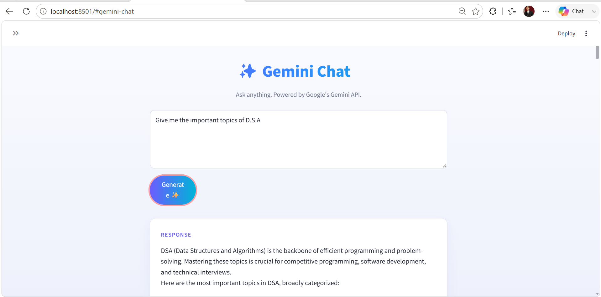

# 🤖 AI Chatbot

An AI-powered chatbot built with **Python** and **Streamlit**. It supports multiple AI models and provides an interactive chat interface.

---

## 📸 Preview

<p align="center">
  
</p>

---

## ✨ Features

- 🤖 AI Chatbot
- 💬 Interactive Chat Interface
- ⚡ Fast Responses
- 🎨 Clean Streamlit UI
- 🔐 Secure API Key Management

---

## 🛠️ Tech Stack

- Python
- Streamlit
- OpenAI API
- Google Gemini
- Anthropic Claude

---

## 🚀 Installation

```bash
git clone https://github.com/Devanshuthakral/AI_CHATBOT

cd AI-Chatbot

pip install -r requirements.txt

streamlit run app.py
```

---

## 🔑 Environment Variables

Create a `.env` file:

```env
OPENAI_API_KEY=your_key
GOOGLE_API_KEY=your_key
ANTHROPIC_API_KEY=your_key
HF_TOKEN=your_key
```

---

## 👨‍💻 Author

**Devanshu Thakral**